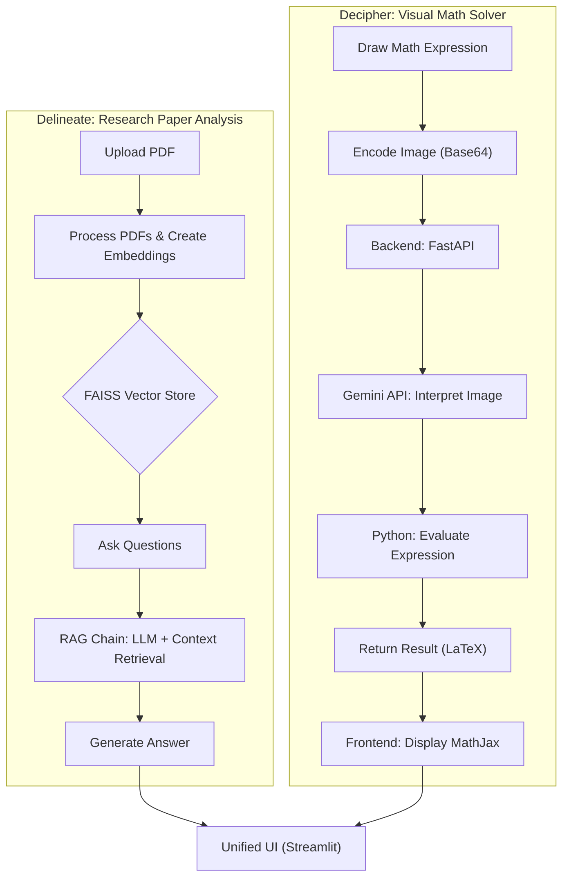

# 🧠 Delineate & Decipher

### A RAG-Powered AI Platform for Research Paper Analysis and Visual Math Problem Solving

 

---

## 📌 Overview

**Delineate & Decipher** is an AI-powered web platform designed to:

* Analyze and retrieve context-aware answers from research papers using Retrieval-Augmented Generation (RAG).
* Solve complex visual mathematical problems via an interactive drawing interface powered by Google Gemini.

This platform empowers researchers, students, and educators to streamline academic work, get real-time solutions, and bridge the gap between document comprehension and math problem solving.

---

## ✨ Features

* 📄 **Research Paper Q\&A (Delineate)**: Upload PDFs, generate vector embeddings, and ask context-sensitive questions.
* 🧮 **Visual Math Solver (Decipher)**: Draw equations and get step-by-step solutions using Gemini Flash API.
* 🔍 **FAISS Vector Search**: Efficiently stores and retrieves document chunks.
* 🤖 **RAG + LLM (Llama/ChatGroq)**: Context-aware, real-time answers.
* 📊 **Supports complex math**: Algebra, calculus, differential equations, matrices, Fourier/Laplace transforms, and more.
* 🔄 **Unified UI**: Seamlessly switch between document analysis and math problem-solving.

---

## 🧰 Tech Stack

| Component      | Technology                                                   |
| -------------- | ------------------------------------------------------------ |
| Frontend       | React, TypeScript, Streamlit                                 |
| Backend        | Python, FastAPI                                              |
| Vector Store   | FAISS                                                        |
| AI Models      | Google Generative AI Embeddings, Gemini, ChatGroq, LLaMA 3.1 |
| Infrastructure | Node.js, Vite, dotenv                                        |
| Deployment     | (Optional) Streamlit Cloud / Docker / VPS                    |

---

## 🚀 Getting Started

### Prerequisites

* Python 3.8+
* Node.js 14+
* npm
* API Keys:

  * `GROQ_API_KEY`
  * `GOOGLE_API_KEY`
    

### Installation

1.  **Clone the repository**

    ```bash
    git clone https://github.com/yourusername/delineate-decipher.git
    cd delineate-decipher
    ```

2.  **Setup Main Backend (Research Paper Analysis - Delineate)**

    This section covers the setup for the RAG-powered backend that handles research paper analysis.

    #### a. Create a Python virtual environment (recommended)
    ```bash
    python -m venv venv-delineate
    source venv-delineate/bin/activate # On Windows: .\\venv-delineate\\Scripts\\activate
    ```

    #### b. Install dependencies
    ```bash
    pip install -r requirements.txt
    ```

    #### c. Run the Streamlit application
    ```bash
    streamlit run app.py
    ```
    The Delineate (Research Paper Analysis) part of the application will then be accessible in your web browser.

3.  **Setup AI Math Solver (Visual Math Problem Solving - Decipher)**

    The visual math solver is a separate module located in the `aimathsolver/` directory. It has its own dedicated frontend and backend.

    Please refer to its specific `README.md` for detailed installation and setup instructions:
    [DELINEATE-AND-DECIPHER/aimathsolver/README.md](aimathsolver/README.md)

    _In summary, the steps within `aimathsolver/` involve:_\
    _• Backend: Creating a Python virtual environment, installing dependencies from `requirements.txt`, setting `GEMINI_API_KEY` in a `.env` file, and running the FastAPI server._\
    _• Frontend: Installing Node.js dependencies (`npm install`), setting `VITE_API_URL` in a `.env` file, and running the Vite development server (`npm run dev`)._

4.  **Set Environment Variables**

    Create a `.env` file in the **root directory** (`DELINEATE-AND-DECIPHER/`) with your API keys:

    ```
    GROQ_API_KEY=your_groq_api_key
    GOOGLE_API_KEY=your_google_api_key
    ```

---

## 🥪 Usage

### 📘 Research Paper Analysis

1. Upload a research paper (PDF).
2. Click "Create Embedding".
3. Ask natural language questions based on the document content.
4. View responses and related document sections.

### ✏️ Visual Math Problem Solving

1. Navigate to the **Decipher** tab.
2. Use the drawing canvas to input an equation.
3. Click "Submit" to solve using the Gemini API.
4. View step-by-step results.

---

## 💡 System Architecture



* Microservices architecture
* Frontend and backend are loosely coupled via REST APIs
* FAISS for fast vector similarity search
* Google Gemini for visual math interpretation
* Modular design for future scalability

---

## 📷 Screenshots

| Research Paper Q\&A             | Visual Math Solver                  |
| ------------------------------- | ----------------------------------- |
|  |  |
| ||
| ||
---

## ✅ Testing

* Functional testing for document analysis and math input
* Performance testing for retrieval and response generation
* Error handling and fallback mechanisms

---

## 📚 References

* FAISS by Facebook AI
* Google Generative AI Embeddings
* Gemini Flash API
* Open-source LLMs (LLaMA 3.1)
* PaperQA and FLARE research papers on RAG

---

## 🤩 Future Enhancements

* Support for scanned handwritten documents via OCR
* Integration with more advanced LLMs (e.g., GPT-4.5, Claude)
* Collaborative workspace for shared academic research

---
## 🎥 Demo Video

[](https://www.youtube.com/watch?v=vWgu-H2IT_M)

Watch our platform in action! Click the badge above to see a demonstration of both the Research Paper Analysis and Visual Math Solving capabilities.

---

## 📄 License

This project is licensed under the MIT License.
