# 🧠 DELINEATE AND DECIPHER

### A Professional RAG-Powered AI Platform for Research Paper Analysis and Visual Math Problem Solving

 


---

## 📌 Overview

**DELINEATE AND DECIPHER** is a sophisticated AI-powered research platform that revolutionizes academic document analysis and mathematical problem-solving through cutting-edge technology:

### 🎯 **Core Capabilities**

**🔬 DELINEATE** - *Advanced Document Intelligence*
- **Structurally-Aware PDF Processing**: Understands document hierarchy, chapters, sections, and headings
- **Hybrid Retrieval System**: Combines structural search with semantic similarity using cross-encoder re-ranking
- **Context-Aware Q&A**: Leverages GPT-OSS-20B with medium reasoning effort for complex academic queries
- **Citation-Rich Responses**: Provides precise page and section references for every answer

**🧮 DECIPHER** - *Visual Math Problem Solving*
- Analyze and retrieve context-aware answers from research papers using Retrieval-Augmented Generation (RAG)
- Solve complex visual mathematical problems via an interactive drawing interface powered by Google Gemini

### 🎓 **Target Audience**
Designed for researchers, PhD candidates, students, and educators who need:
- Efficient academic paper analysis and information extraction
- Quick access to relevant research insights without endless scrolling
- Professional-grade document processing with structural understanding
- Reliable citation tracking and source verification

---

## ✨ Key Features

### 📄 **Advanced Document Processing (DELINEATE)**
- **Intelligent PDF Analysis**: Automatic extraction of document structure including chapters, sections, and subsections
- **Vector Embeddings with Metadata**: Preserves document hierarchy for enhanced retrieval accuracy
- **Cross-Encoder Re-ranking**: Advanced semantic matching beyond simple similarity search
- **Multi-Strategy Retrieval**: Structural search for direct section matches, semantic search for complex queries
- **Source Citations**: Every response includes precise page numbers and section references
- **Conversation Memory**: Maintains context across multiple questions for coherent discussions
- **Complete Reset Functionality**: Clean slate option for new document analysis sessions

### 🧮 **Visual Math Solver (DECIPHER)**
- Draw equations and get step-by-step solutions using Gemini Flash API
- Supports complex math: Algebra, calculus, differential equations, matrices, Fourier/Laplace transforms
- Interactive drawing canvas for natural math input
- LaTeX rendering for professional mathematical notation

### 🔧 **Technical Excellence**
- **FAISS Vector Database**: Lightning-fast similarity search with IndexFlatL2 optimization
- **Modular Architecture**: Clean separation of concerns across 8 specialized modules
- **Robust Error Handling**: Comprehensive validation and graceful failure recovery
- **Performance Monitoring**: Built-in timing and statistics for optimization insights
- **Streamlit Integration**: Modern, responsive web interface with real-time updates

---

## 🧰 Technology Stack

### **🎯 Core Technologies**

| Component | Technology | Version | Purpose |
|-----------|------------|---------|----------|
| **Web Framework** | Streamlit | ≥1.28.0 | Modern web interface with real-time updates |
| **PDF Processing** | PyMuPDF | ≥1.23.0 | Reliable text extraction and document parsing |
| **Vector Database** | FAISS-CPU | ≥1.7.4 | High-performance similarity search |
| **Embeddings** | SentenceTransformers | ≥2.2.2 | all-MiniLM-L6-v2 for semantic understanding |
| **Re-ranking** | Cross-Encoder | - | ms-marco-MiniLM-L-6-v2 for precision |
| **Text Processing** | LangChain | ≥0.1.0 | RecursiveCharacterTextSplitter for chunking |
| **LLM API** | Groq | ≥0.4.0 | GPT-OSS-20B with reasoning capabilities |
| **Environment** | Python-dotenv | ≥1.0.0 | Secure configuration management |

### **🏗️ Architecture Highlights**
- **Modular Design**: 8 specialized modules for maintainability and scalability
- **Caching Strategy**: Streamlit resource caching for optimal performance
- **Error Resilience**: Comprehensive validation and fallback mechanisms
- **Type Safety**: Full type hints and validation throughout the codebase

---

## 🚀 Quick Start Guide

### **📋 Prerequisites**

- **Python**: 3.8+ (recommended: 3.9 or 3.10)
- **Operating System**: Windows 10/11, macOS, or Linux
- **Memory**: Minimum 4GB RAM (8GB+ recommended for large documents)
- **API Keys Required**:
  - `GROQ_API_KEY` - For GPT-OSS-20B model access
  - `GOOGLE_API_KEY` - For Decipher math solving (optional)

### **⚡ Installation**

#### **1. Repository Setup**
```bash
git clone https://github.com/yourusername/delineate-and-decipher.git
cd delineate-and-decipher
```

#### **2. Python Environment Setup**
```bash
# Create virtual environment
python -m venv venv

# Activate virtual environment
# Windows:
venv\Scripts\activate
# macOS/Linux:
source venv/bin/activate
```

#### **3. Dependencies Installation**
```bash
# Install all required packages
pip install -r requirements.txt
```

#### **4. Setup AI Math Solver (Visual Math Problem Solving - Decipher)**

The visual math solver is a separate module located in the `aimathsolver/` directory. It has its own dedicated frontend and backend.

Please refer to its specific `README.md` for detailed installation and setup instructions:
[DELINEATE-AND-DECIPHER/aimathsolver/README.md](aimathsolver/README.md)

*In summary, the steps within `aimathsolver/` involve:*\
*• Backend: Creating a Python virtual environment, installing dependencies from `requirements.txt`, setting `GEMINI_API_KEY` in a `.env` file, and running the FastAPI server.*\
*• Frontend: Installing Node.js dependencies (`npm install`), setting `VITE_API_URL` in a `.env` file, and running the Vite development server (`npm run dev`).*

#### **5. Environment Configuration**
Create a `.env` file in the root directory:
```env
# Required for DELINEATE functionality
GROQ_API_KEY=your_groq_api_key_here

# Optional for DECIPHER functionality
GOOGLE_API_KEY=your_google_api_key_here
```

#### **6. Launch Application**
```bash
streamlit run app.py
```

🎉 **Success!** Your application will be available at `http://localhost:8501`

---

## 📖 Usage Guide

### **📚 DELINEATE - Research Paper Analysis**

#### **Step 1: Document Upload**
- Navigate to the **"Delineate"** section
- Upload your research paper (PDF format, up to 50MB)
- Supported formats: Text-based PDFs (OCR for scanned documents coming soon)

#### **Step 2: Document Processing**
- Click **"Process PDF"** to begin analysis
- The system will:
  - Extract text while preserving document structure
  - Identify chapters, sections, and subsections
  - Create vector embeddings with metadata
  - Build FAISS index for fast retrieval

#### **Step 3: Interactive Q&A**
- Ask questions in natural language
- Examples:
  - *"What are the main findings in the methodology section?"*
  - *"Explain the experimental results"*
  - *"What conclusions does the author draw?"*

#### **Step 4: Review Responses**
- Each answer includes:
  - **Direct response** based solely on document content
  - **Source citations** with page numbers and sections
  - **Relevance scores** for transparency
  - **Context snippets** for verification

#### **🔧 Advanced Features**
- **Structural Search**: Direct section matching for precise queries
- **Semantic Search**: Vector similarity for complex concepts
- **Chat History**: Maintains conversation context
- **Reset Options**: Clear chat or reset all data completely

### ✏️ Visual Math Problem Solving

1. Navigate to the **Decipher** tab.
2. Use the drawing canvas to input an equation.
3. Click "Submit" to solve using the Gemini API.
4. View step-by-step results.

---

## 🏗️ System Architecture

### **📁 Modular File Structure**

```
DELINEATE-AND-DECIPHER/
├── app.py                 # Main Streamlit application entry point
├── config.py             # Configuration management and environment variables
├── models.py             # AI model initialization and caching
├── pdf_processor.py      # PDF extraction and structure analysis
├── vector_store.py       # FAISS operations and embedding management
├── retrieval.py          # Advanced hybrid retrieval with re-ranking
├── ui_components.py      # Reusable Streamlit UI components
├── utils.py              # Helper functions and validation utilities
├── requirements.txt      # Python dependencies
└── assets/              # Static assets and documentation images
```

### **🔄 Processing Pipeline**

```mermaid
graph TD;
    subgraph Delineate_Section["DELINEATE: Advanced Document Analysis"]
        A["📄 Upload PDF"] --> B["🔍 Structure Analysis & Text Extraction"]
        B --> C["✂️ Intelligent Chunking with Metadata"]
        C --> D["🧠 Generate Embeddings (SentenceTransformer)"]
        D --> E["⚡ Build FAISS Vector Index"]
        E --> F["❓ User Query Input"]
        F --> G["🎯 Hybrid Retrieval (Structural + Semantic)"]
        G --> H["🔄 Cross-Encoder Re-ranking"]
        H --> I["🤖 GPT-OSS-20B Response Generation"]
        I --> J["📋 Formatted Answer with Citations"]
    end

    subgraph Decipher_Section["DECIPHER: Visual Math Solver"]
        K["✏️ Draw Math Expression"] --> L["📸 Encode Image (Base64)"]
        L --> M["🚀 Backend: FastAPI"]
        M --> N["🔮 Gemini API: Interpret Image"]
        N --> O["🐍 Python: Evaluate Expression"]
        O --> P["📐 Return Result (LaTeX)"]
        P --> Q["🎨 Frontend: Display MathJax"]
    end

    J --> R["🖥️ Unified Streamlit Interface"]
    Q --> R

    style Delineate_Section fill:#e1f5fe
    style Decipher_Section fill:#f3e5f5
    style R fill:#e8f5e8
```



### **🎯 Architecture Principles**
- **Microservices Design**: Loosely coupled components for scalability
- **Separation of Concerns**: Each module handles specific functionality
- **Performance Optimization**: Caching strategies and efficient indexing
- **Error Resilience**: Comprehensive validation and fallback mechanisms
- **Extensibility**: Easy to add new features and integrations

---

## 📷 Screenshots

| Research Paper Q\&A             | Visual Math Solver                  |
| ------------------------------- | ----------------------------------- |
|  |  |
| ||
| ||
---

## 📊 Performance & Specifications

### **⚡ Performance Metrics**
- **Document Processing**: ~2-5 seconds per page (depending on complexity)
- **Query Response Time**: <3 seconds for most queries
- **Vector Search**: Sub-millisecond similarity search with FAISS
- **Memory Usage**: ~500MB base + ~50MB per processed document
- **Supported File Sizes**: Up to 50MB PDFs (typically 100+ pages)

### **🎯 Accuracy Features**
- **Structural Awareness**: Preserves document hierarchy for better context
- **Cross-Encoder Re-ranking**: Improves retrieval precision by 20-30%
- **Citation Tracking**: 100% verifiable source references
- **Confidence Scoring**: Transparency in retrieval quality

### **🔧 Technical Specifications**
- **Chunk Size**: 512 tokens with 128 token overlap
- **Embedding Model**: all-MiniLM-L6-v2 (384 dimensions)
- **Vector Index**: FAISS IndexFlatL2 for exact search
- **API Integration**: Official Groq Python client for reliability
- **Session Management**: Streamlit session state for conversation memory

---

## 📚 Technical References

### **🔬 Research & Publications**
- **FAISS**: Efficient Similarity Search and Clustering of Dense Vectors - Facebook AI Research
- **Sentence Transformers**: Sentence-BERT for Universal Sentence Embeddings
- **Cross-Encoder Models**: Improving Passage Retrieval with Zero-Shot Question Generation
- **RAG Architecture**: Retrieval-Augmented Generation for Knowledge-Intensive NLP Tasks
- **Document Structure Analysis**: Layout-Aware Information Extraction

### **🛠️ Technology Documentation**
- [Streamlit Documentation](https://docs.streamlit.io/) - Web application framework
- [FAISS Documentation](https://faiss.ai/) - Vector similarity search
- [Groq API Documentation](https://console.groq.com/docs) - LLM API integration
- [SentenceTransformers](https://www.sbert.net/) - Embedding models
- [PyMuPDF Documentation](https://pymupdf.readthedocs.io/) - PDF processing

### **📖 Academic Context**
- Information Retrieval and Question Answering systems
- Natural Language Processing for academic documents
- Vector databases and semantic search optimization
- Human-Computer Interaction in research tools

---

## 🎯 Future Enhancements

### **🔄 Planned Features**
- **Multi-Document Analysis**: Compare and synthesize across multiple papers
- **Advanced OCR Integration**: Support for scanned documents and handwritten notes
- **Citation Export**: Direct export to BibTeX, EndNote, and Zotero
- **Collaborative Features**: Team workspaces and shared document collections
- **Advanced Math Integration**: Enhanced mathematical notation support
- **API Access**: RESTful API for integration with other research tools

### **🚀 Technical Roadmap**
- **Performance Optimization**: GPU acceleration for larger document collections
- **Advanced Models**: Integration with latest embedding and LLM models
- **Cloud Deployment**: Docker containerization and cloud-native deployment
- **Security Enhancements**: Enterprise-grade authentication and authorization
- **Analytics Dashboard**: Usage statistics and performance insights

---

## 🚦 Troubleshooting & Support

### **⚠️ Common Issues**

| Issue | Solution |
|-------|----------|
| **"GROQ_API_KEY not configured"** | Ensure `.env` file exists with valid API key |
| **PDF processing fails** | Check file size (<50MB) and ensure it's text-based |
| **Empty responses** | Verify document has readable text (not scanned images) |
| **Slow performance** | Ensure sufficient RAM (8GB+) for large documents |
| **Import errors** | Reinstall dependencies: `pip install -r requirements.txt` |

### **📞 Getting Help**
- **Documentation**: Comprehensive inline help in the application
- **Error Messages**: Detailed feedback for troubleshooting
- **Performance Monitor**: Built-in timing for optimization
- **Debug Mode**: Enable detailed logging for issue diagnosis

### **🔧 System Requirements**
- **Minimum**: Python 3.8, 4GB RAM, 2GB disk space
- **Recommended**: Python 3.10, 8GB RAM, 5GB disk space
- **Network**: Stable internet connection for API calls

---

## 🎆 Contributing & Development

### **👥 Development Guidelines**
- **Code Style**: Follow PEP 8 standards with comprehensive type hints
- **Module Structure**: Maintain clean separation of concerns across 8 specialized modules
- **Documentation**: Include detailed docstrings and inline comments
- **Testing**: Write unit tests for new features and comprehensive error handling
- **Version Control**: Use semantic versioning and meaningful commit messages

### **🔧 Development Setup**
```bash
# Clone the repository
git clone https://github.com/yourusername/delineate-and-decipher.git
cd delineate-and-decipher

# Set up development environment
python -m venv venv-dev
source venv-dev/bin/activate  # Windows: venv-dev\Scripts\activate

# Install dependencies
pip install -r requirements.txt

# Run in development mode with auto-reload
streamlit run app.py --server.runOnSave true
```

### **🐛 Issue Reporting**
When reporting issues, please include:
- Python version and operating system
- Complete error messages and stack traces
- Steps to reproduce the problem
- Sample PDF (if applicable) for testing

---

## 🙏 Acknowledgments

### **🤝 Special Thanks**
- **Open Source Community**: For the incredible tools and libraries that power this platform
- **Research Community**: For advancing the fields of NLP, Information Retrieval, and AI
- **Streamlit Team**: For creating an amazing framework for AI applications
- **Contributors**: All developers who have contributed to improving this platform

### **📜 Academic Citations**
If you use this platform in your research, please consider citing:
```bibtex
@software{delineate_decipher,
  title={DELINEATE AND DECIPHER: A Professional RAG Platform for Academic Research},
  author={Rohan Mallick},
  url={https://github.com/coderRohan123/delineate-and-decipher}
}
```

---
## 🎥 Demo Video

[](https://www.youtube.com/watch?v=vWgu-H2IT_M)

Watch our platform in action! Click the badge above to see a demonstration of both the Research Paper Analysis and Visual Math Solving capabilities.

---

## 📄 License

This project is licensed under the MIT License.
