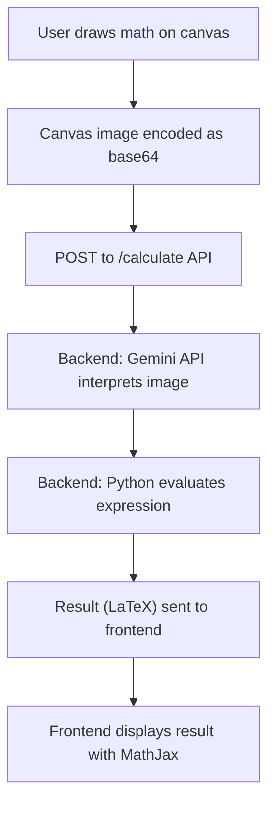

# 🧮 AI Math Solver (Decipher)

[← Back to Main Project](../README.md)

 

---

## 📌 Overview

**AI Math Solver (Decipher)** is a visual math problem-solving module within the [Delineate & Decipher](../README.md) platform. It enables users to draw mathematical expressions, which are then interpreted and solved using advanced AI models (Google Gemini). The results are rendered in LaTeX for clarity and academic use.

---

## ✨ Features

- ✏️ Draw math expressions on a digital canvas
- 🤖 AI-powered recognition and solution of handwritten math
- 📐 LaTeX rendering of results for academic presentation
- 🧠 Variable assignment and memory for multi-step problems
- 🎨 Modern, responsive UI (Mantine + TailwindCSS)

---

## 🧠 Theory & Approach

### 1. **Image-to-Math Recognition**
- The user draws a math expression on a canvas (React frontend).
- The canvas image is encoded as a base64 PNG and sent to the backend.
- The backend uses the Google Gemini API (vision model) to interpret the handwritten or drawn math expression.
- The recognized expression is parsed and, if needed, variables are assigned for multi-step calculations.

### 2. **Math Solving & LaTeX Rendering**
- The backend evaluates the recognized expression using Python logic.
- The result (and optionally, the step-by-step solution) is returned to the frontend.
- The frontend displays the result using MathJax for high-quality LaTeX rendering.

### 3. **AI/ML Concepts**
- **Vision AI**: Uses Gemini's vision capabilities to convert images to structured math expressions.
- **Natural Language Processing**: For parsing and understanding ambiguous or complex math input.
- **Stateful Calculation**: Supports variable assignment, so users can solve multi-step problems interactively.

---

## 🗂️ Folder Structure

```
DELINEATE-AND-DECIPHER/aimathsolver/
├── aicalcfrontend/   # React + Vite + Mantine frontend
└── aicalcbackend/    # FastAPI + Gemini API backend
```

---

## 🛠️ Installation & Setup

### 1. Clone the Repository
```bash
git clone <repo-url>
cd DELINEATE-AND-DECIPHER/aimathsolver
```

### 2. Backend Setup

#### a. Create a virtual environment
```bash
cd aicalcbackend
python -m venv venv
source venv/bin/activate  # On Windows: venv\Scripts\activate
```

#### b. Install dependencies
```bash
pip install -r requirements.txt
```

#### c. Set up environment variables
Create a `.env` file in `aicalcbackend/`:
```
GEMINI_API_KEY=your_google_gemini_api_key
```

#### d. Run the backend server
```bash
uvicorn main:app --host 0.0.0.0 --port 8900 --reload
```

The backend will be available at [http://localhost:8900/](http://localhost:8900/).

---

### 3. Frontend Setup

#### a. Install dependencies
```bash
cd ../aicalcfrontend
npm install
```

#### b. Configure API URL
Create a `.env` file in `aicalcfrontend/`:
```
VITE_API_URL=http://localhost:8900
```

#### c. Run the frontend
```bash
npm run dev
```

The frontend will be available at [http://localhost:5173/](http://localhost:5173/) (default Vite port).

---

## 🥪 Usage
1. Open the frontend in your browser.
2. Draw a math expression on the canvas.
3. Click the **Solve** button to send the image to the backend.
4. View the recognized expression and its solution in LaTeX format.

---

## 🔄 How It Works



---

## 📡 API Reference

### POST `/calculate`
- **Request Body:**
  ```json
  {
    "image": "data:image/png;base64,...",
    "dict_of_vars": {}
  }
  ```
- **Response:**
  ```json
  {
    "message": "Image processed",
    "data": [
      { "expr": "x+2", "result": "5", "assign": false }
    ],
    "status": "success"
  }
  ```

---

## 🚑 Troubleshooting & Tips
- Ensure your Google Gemini API key is valid and has vision access.
- If the backend fails to start, check Python version (3.8+) and dependency installation.
- For CORS errors, confirm the frontend `VITE_API_URL` matches the backend URL.
- For best results, draw math expressions clearly and avoid overlapping symbols.

---

## 🚀 Deployment (Vercel)
Both frontend and backend have `vercel.json` for serverless deployment. Push to your Vercel-connected repo and set the required environment variables in the Vercel dashboard.

---

## 📚 References & Acknowledgements
- [FastAPI](https://fastapi.tiangolo.com/)
- [Vite](https://vitejs.dev/)
- [Mantine](https://mantine.dev/)
- [MathJax](https://www.mathjax.org/)
- [Google Gemini API](https://ai.google.dev/)
- [Main Project: Delineate & Decipher](../README.md)

---

## 📄 License
This project is licensed under the MIT License. 